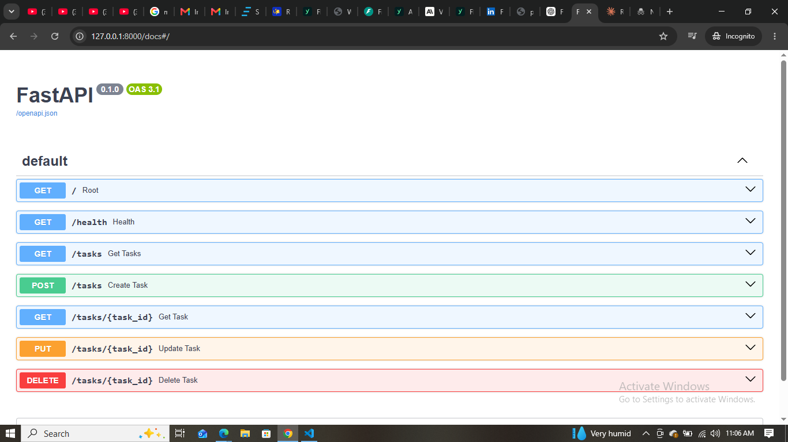

FlyRank Backend AI Engineering — Task CRUD API
A simple **CRUD API built with Python and FastAPI** as part of the FlyRank Backend AI Engineering track.

The API manages tasks and demonstrates the basic backend operations:

* **Create** a task
* **Read** all tasks or a single task
* **Update** a task
* **Delete** a task

The project also includes input validation, HTTP status codes, Swagger UI documentation, and Git/GitHub version control.

## Tech Stack

* Python
* FastAPI
* Uvicorn
* Pydantic
* Git & GitHub

## Installation

Clone the repository and open the project folder.

Install the required packages:

```bash
pip install fastapi uvicorn pydantic
```

## Run the API

Start the FastAPI development server with:

```bash
py -m uvicorn main:app --reload
```

The API will be available at:

```text
http://127.0.0.1:8000
```

## Swagger UI

FastAPI automatically generates interactive API documentation.

Open:

```text
http://127.0.0.1:8000/docs
```

From Swagger UI, you can use **Try it out** to create, read, update, and delete tasks without using curl.

## API Endpoints

| Method | Endpoint           | Description                            |
| ------ | ------------------ | -------------------------------------- |
| GET    | `/`                | Returns information about the Task API |
| GET    | `/health`          | Checks whether the API is running      |
| GET    | `/tasks`           | Returns all tasks                      |
| GET    | `/tasks/{task_id}` | Returns one task by ID                 |
| POST   | `/tasks`           | Creates a new task                     |
| PUT    | `/tasks/{task_id}` | Updates a task                         |
| DELETE | `/tasks/{task_id}` | Deletes a task                         |

## Example Request

### Create a task

```bash
curl -i -X POST http://127.0.0.1:8000/tasks -H "Content-Type: application/json" -d "{\"title\":\"Buy milk\"}"
```

Example response:

```text
HTTP/1.1 201 Created
content-type: application/json

{"id":4,"title":"Buy milk","done":false}
```

## CRUD Flow

The complete CRUD cycle can be performed through Swagger UI:

```text
POST   → Create a task
GET    → Read the task
PUT    → Update the task
DELETE → Delete the task
GET    → Confirm the task was deleted
```

The API uses appropriate HTTP status codes:

| Status Code | Meaning                                     |
| ----------- | ------------------------------------------- |
| 200         | Request successful                          |
| 201         | Task successfully created                   |
| 204         | Task successfully deleted; no response body |
| 400         | Invalid request                             |
| 404         | Task not found                              |
| 422         | Invalid JSON or request validation error    |

## Swagger UI Screenshot



## Project Structure

```text
flyrank-backend-ai-engineering/
│
├── main.py
├── body.json
├── .gitignore
└── README.md
```

## Learning Outcome

This project demonstrates the fundamentals of building and documenting a REST API with FastAPI, including:

* HTTP methods and status codes
* Path parameters
* JSON request bodies
* Pydantic data validation
* CRUD operations
* Error handling
* Swagger/OpenAPI documentation
* Git version control
* Publishing a project to GitHub
